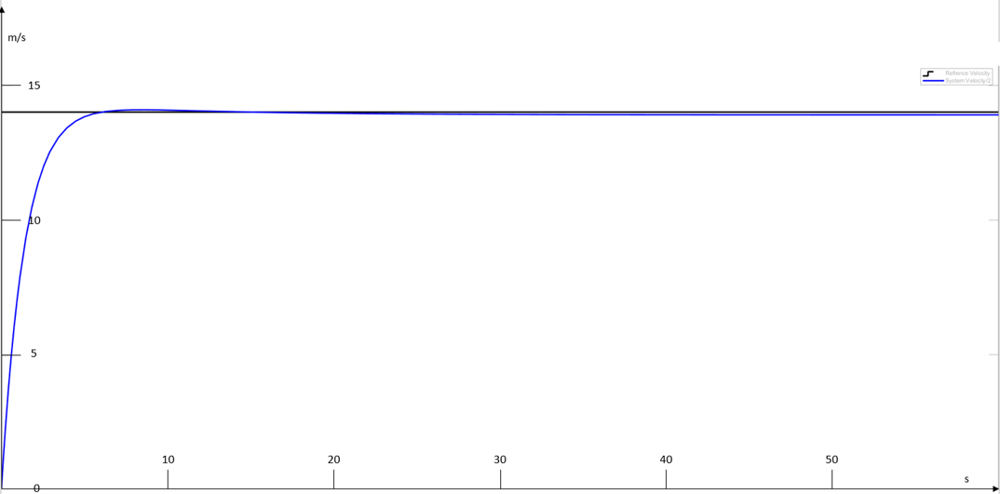

# Electrified_Cart

## CONTROLLER DESIGN FOR ELECTRIFIED CART USING MODEL BASED DESIGN APPROACH


- [ Introduction](#introduction)
    - [ Approach](#11-approach)
   - [ Requirements](#12-requirements)
- [ Subsystem decomposition](#2-subsystem-decomposition)
   [ Driver](#21-driver)
   - [ Frame](#22-frame)
   - [ Wheels (Rear)](#23-wheels-rear)
   - [Environment](#24-environment)
   - [ Motors (Left/ Right)](#25-motors-left-right)
   - [ Gearbox](#26-gearbox)
   - [ Battery](#27-battery)
   - [Controller](#28-controller)
- [ Analysis and validation](#3-analysis-and-validation)
   - [ eCart frame](#31-ecart-frame)
   - [Motors](#32-motors)
- [Controller design](#4-controller-design)
- [ Performance analysis](#5-performance-analysis)
- [Conclusion](#6-conclusion)
   - [Lessons / Areas of possible improvement](#61-lessons--areas-of-possible-improvement)
   - [Summary](#62-summary)
- [Appendix A](#a-appendix-a)
- [Bibliography](#bibliography)

  


## 1 Introduction

### 1.1 Approach

The E-Go Kart has its drive system and other components equipped except for a controller design, which is the primary goal of this project is to design a controller that can meet the requirements set by the team/supervisor. The system is programmed in block-oriented programming using Matlab/Simulink. It can run codes for executing basic functions as well as the implementation and testing of controller parameters and optimization algorithms.

Set goals, requirements, specifications, and system design are mentioned. The decomposition into subsystems, the development of the model, and its comparison against the requirements are presented. In Chapter 4, an overview with along with the sources for the parameters and type of controller used is mentioned.

A performance analysis follows in Chapter 5.

### 1.2 Requirements

For the control system to fully function, It has to meet several requirements:

- Constant velocity control
- Maximum velocity of 50 Km/h
- Minimum acceleration to reach the desired speed within 20s
- Maximum overshoot within a 10% threshold
- Total weight of 160 Kg ±
- Constant slope with a maximum inclination of 5◦

The Matlab script used is attached in Appendix A.


## 2 Subsystem decomposition

In order to decompose the system, the different interfaces of the cart have been identified. They are defined as follows:

- Driver
- Frame
- Wheels
- Environment
- Motor (Left/ Right)
- Gearbox (Left/ Right)
- Battery
- Controller

### 2.1 Driver

The driver is the passenger of the cart who needs to be transported. The driver adds weight to the cart frame and is able to steer. It is assumed that the steering has no influence on the dynamics of the cart. As the desired speed of the cart is set to a fixed value the driver can only control the power on/off-state of the cart.

### 2.2 Frame

The frame holds all components of the cart. It carries the driver and provides the current position and velocity of the system as well as the total mass. It gets its velocity as input from the wheels.


### 2.3 Wheels (Rear)

The wheels are the connection between the environment and the cart. They get a drag force as input from the environment and convert it into a torque which is then applied through the gearboxes to the motors. In the opposite direction, the motors deliver the required torque in order to obtain the desired velocity through the gearboxes to the rear wheels.

### 2.4 Environment

The environment describes the road conditions which cause an overall drag force on the cart. This overall drag force sums up all the forces that are present on the cart by applying them on the wheels which act as the connecting interface. Those forces are slope down force, friction force and aerodynamic force which are calculated based
on the before-mentioned requirements, specifications, and assumptions.

### 2.5 Motors (Left/ Right)

The motors (one on each side) are the actuators of the system. They provide the required torque in order to overcome the resistance coming from the wheels and to maintain the desired velocity. To do so, they are controlled by the controller via voltage control and are provided with current by the battery. Furthermore, the motor
driver signals the actual velocity to the controller.

### 2.6 Gearbox

The gearboxes provide a torque/ angular velocity ratio between the wheel shafts and the motor shafts.

### 2.7 Battery

The battery is the power source of the system. It powers all electric components, i.e., the controller and the two dc-motors. The voltage output of the battery to the motors is controlled by the controller.


### 2.8 Controller

As already stated, the PI controller is programmed such that the cart maintains the desired velocity. It gets the actual velocity from the motor driver and controls the voltage which is acting from the battery to the motors in order for the motors to provide the needed torque.

The resulting subsystems and their input- and output signals are presented in the following diagram in Figure 2.1. To keep the complexity low the cart frame and the wheels as well as the motors and the gearboxes are combined into one subsystem each.


$figure2.1:$ System decomposition 


## 3 Analysis and validation

The model consists of two main subsystems: frame and motors, figure. The frame section incorporates all resistance and driving forces to produce a motion, while the motor subsystem outputs torque based on an input voltage and torque load coming from the frame subsystem. The two gear reducers are integrated into the motor system as a gain on the input and output torques, while the reduced mass moment of inertia is combined with the rotor inertia. In this chapter, both subsystems are analyzed based on their governing equations and validated using artificial inputs while monitoring the output separately for each subsystem.


$figure 3.1: $ eCart system outlook 

### 3.1 eCart frame

The frame subsystem is transferring the motion from the motor to the ground while taking all resistances into account. Figure 3.2 shows a free-body diagram of the system, and it is followed by the governing equations used for the Simulink model.


$figure3.2:$ Free-body diagram of the system

Governing equations $^1$ :

$$
\begin{align}
M\ddot{x} = F_m − F_d  + W sin( β )−F_f
\end{align}
$$

$$
\begin{align}
Fm= τ m;W=Mg ; Ff =uWcos( β ) ; F_d=A_f C_d \frac{ρ_a\dot{x}^2}{2}
\end{align}
$$

$$
\begin{align}
M\ddot{x} = \frac{τ_m}{r}-A_fC_d\frac{ρ_a\dot{x}^2}{2}- Mg(sin( β ) + ucos( β ))
\end{align}
$$

where

$M$ = total mass (driver + eCart)

$F_m$ = traction force from motor

$F_d$ = drag force

$F_f$ = rolling resistance force

$W$ = weight

$β$ = slope angle

$r$ = wheel radius


$u$ = rolling resistance force constant

$^1$ (Nasri and Brahim, 2011)


Implementing the final equation into Simulink model results in the eCart frame subsystem shown in figure 3.3, where the input is the motor torque, and the outputs are velocity and torque load on the motor indicated as Wheel Torque. Additionally, a wind velocity constant is included to account for the change in aerodynamic drag
in the case of wind.


$figure3.3:$ eCart frame subsystem

To validate the model, first a test scenario with constant motor torque neglecting the air resistance and assuming a slope of 0 degrees was developed. The resulting equation is as follows:

$$
\begin{align}
M\ddot{x} = \frac{τ_m}{rM}- gucos( β )
\end{align}
$$

Taking a random constant torque _τ_ m=20 N/m , rolling resistance coefficient u = 0.01 and a mass M = 160kg the equation becomes:

$\ddot{x} = \frac{20N/m}{0.2m·180kg}-9.8m/s^2 · 0.01 $
$\ddot{x} = 0.4574m/s^2$

Integrating both sides

$\dot{x} = 0.4574t C_1$

For initial conditions $\dot{x_0},t_0 = 0 → C_1 =0.$  Therefore, the expected speed at t = 10s is:

$\dot{x_1}_0 =0.4574m/s$

Figure 3.9 shows the test system equivalent to the original subsystem without the outputs and using a constant torque.


$figure3.4:$ eCart frame subsystem test setup

The resulting velocity graph is presented in Figure 3.5 confirming the expected velocity.


$figure3.5:$ eCart velocity graph with neglected air resistance and
slope of 0 degrees

Tests adding a slope of 2 degrees (0.035rad) and wind resistance confirm the validity of the subsystem. As expected, adding a slope decreases the reached velocity at time t = 10s, with velocity graph shown in Figure 3.


$figure3.6:$ eCart velocity graph with neglected air resistance and
slope of 2 degrees

Adding a wind resistance produces a curved graph due to the square of velocity in the drag force formulation. Figure 3.6 shows the resulting curve at time t=50s


$figure3.7:$ eCart velocity graph with air resistance and slope of 2
degrees

### 3.2 Motors

The two motors used for the project are identical and use the following governing equations:
$$
\begin{align}
\ddot{i}=\frac{1}{l}(V-\dot{θ}_mK_b-Ri_a)
\end{align}
$$

$$
\begin{align}
\ddot{θ}_m=\frac{1}{J_m}(K_mi_a-B_m\dot{θ}_m - T_l)
\end{align}
$$

With the following notations:

$V$ = voltage

$K_b$ = back emf constant

$B_m$ = motor friction coefficient

$R$ = armature resistance

$\dot{θ}$= rotational velocity of motor

$\ddot{θ}$= angular acceleration of motor

$K_m$ = motor torque constant


$J_m$ = total coupled moment of inertia


$T_l$= torque load

$i_a$= armature current

Additionally, the reduced mass moment of inertia of cart and wheels is added to the motor inertia to account for the total moment of inertia of the whole system.

The inputs to the subsystems are a voltage controlled by the PD controller combined with a torque load coming from the eCart subsystem. Output is the torque produced by the motor.

Since the gearbox is integrated in the motor subsystems additional constant for the gear ratio Gr = 7.27 is introduced to the ingoing and output torques. Figure 3. shows the resulting Simulink sub model, the second visible output is only for monitoring the angular speed of the motor.


$figure3.8:$ Motor subsystem outlook

Test procedure for the motors is as follows:

1. Applying constant 48V with torque load Tl = 0 while monitoring the angular speed of the motor. (only motor inertia taken into account)
2. Applying constant 20V with torque load Tl = 0 while monitoring the angular speed of the motor. (only motor inertia taken into account)
3. Applying constant 48V and a ramped torque load for 10 seconds from 0 to the motor stall torque, 1 second after start while monitoring the angular velocity.(only motor inertia taken into account)

Figure 3.9 shows the system used for the second testing procedure, while the first
one is carried out without an input for the load.


Figure 3.10 presents the result of the first test case and the system behaves as ex-
pected having an almost constant no-load speed of 5400 rpm or approximately 560
rad/s.

Figure 3.11 presents the result of the second test case with a maximum angular speed
of 280 rad/s is the expected result.

The third test result is displayed on Figure 3.12 indicating a no-load speed for 1
second followed by a constant slope ramped torque input until stall torque and
speed of 0 rad/s is reached.


$figure3.9:$ eCart frame subsystem test setup


$figure3.10:$ Motor rotational velocity test case 1


$figure3.11:$ Motor rotational velocity test case


$figure3.12:$ Motor rotational velocity test case


## 4 Controller design

The controller corrects the error of the model by taking the actual and required outputs of a model. The easiest approach to do so is to produce an actuating signal proportional to the error, i.e., the more the error, the higher will be the actuating signal magnitude, which results in an output that matches the required output. The above controller is called a Proportional controller $^1$.

If there are any inherent limitations that lead to steady-state error. The integral of that error is used to reduce the steady-state error, this is called an integral controller. This controller can also perform in noisy environments. A combination of these two controllers is a PI controller. A PI controller reduces both the rise time and the steady state errors of the system. Therefore, initially, it has been decided to use a PI controller in our system $^2$ .

Tuning a controller is a critical process to ensure the optimal performance of the system. There are several methods to tune a controller, including the Ziegler-Nichols method, Cohen-Coon method, and the trial-and-error method $^3$ . Here the trial-and-error method for the tuning has been utilized.

Initially implementing the PI controller in the open system with a proportional gain (Kp) and Integral gain (Ki) of 1 and upper output limit of 48.

$^1$ (Hinton, Osindero, and Teh, 2006)\
$^2$ (Orozco-Alzuru, Gómez-Ramirez, and Moreno-Cáceres, 1991)\
$^3$ (LeCun et al., 1998)


The Figure 4.1 below shows the comparison of the reference and the resulting velocity of the system.


$figure4.1:$ Reference velocity and output velocity of the system

As can be seen, the system oscillates and overshoots, but the steady-state error is close to zero. Because it’s known that the integral gain is responsible for these. Attempts to reduce it in the following step are executed. After a few simulations, it is noticed that the steady-state error increased as Ki decreased.


As a result, the proportional gain is raised. The following system controller in Figure 4.2 uses this algorithm.


$figure4.2:$ PI controller and its parameters

From Figure 4.3 we can confirm that the controller is appropriate for our system. Further validation of the system is presented in the performance analysis.


$figure4.3:$ Reference velocity and controlled output velocity of the system


## 5 Performance analysis

In this chapter, the performance/controller against the requirements is performed. Therefore, each previously defined requirement is checked if it is fulfilled in the simulation.

The first requirement is a constant velocity for the cart. In Figure 5.1 it can be seen, that a constant velocity is reached, so this requirement is fulfilled.


$figure5.1:$ Velocity graph of cart in [m/s]

The second requirement is the maximum velocity of 50kph, measuring the velocity in the constant velocity area results in 13.8m/s which equals 49.68kph. As a result, this second requirement is fulfilled. Also in Figure 5.1, it is visible that the overshoot is less than 10%. The maximum overshoot in this model is about 1.3%, accordingly,
the requirement is fulfilled.

The next requirement is to reach the desired speed of 50kph within 20s this is also fulfilled, by reaching the desired speed in 9s, which can be verified by measuring as seen in the same figure.

The requirement for the total weight of 110kg up to 210kg is also satisfied, which is shown in Figure 5.2 and Figure 5.3. There it can be seen, that both two graphs satisfy the previous requirements. In the first case with 110kg, there is no overshoot present.


$figure5.2:$ Velocity graph at a total weight of 110kg



$figure5.3:$ Velocity graph at a total weight of 210kg

The last requirement with a maximum inclination of 5◦can also be satisfied when neglecting the acceleration time of less than 20s, which can not be reached due to the selected motor. To reach this requirement, a different motor must be used, to fulfill the acceleration time.

Concluding all the requirements are fulfilled and the controller and Performance analysis is done.


## 6 Conclusion

### 6.1 Lessons / Areas of possible improvement

- **Obtaining original motor data sheet:** Since the motor manufacturer did not provide the datasheet, a comparable motor type had to be used. Unfortunately, not all needed parameters were provided in the datasheet, so educated guesses had to be made, which later manifested in the results as it is explained in the validation section. So, it was understood that in order to obtain accurate desired outputs, the actual data sheet of the motors that are installed on the cart should have been used.
- **Exploring other controller types:** Apparently there are other types of controllers that could have been used for the model but could not be explored due to time constraints. Future works should definitely consider investigating and comparing the various controller types in the hopes of finding one that is extremely robust in terms of speed control.
- **Banked roadways and slip conditions:** Road conditions play a crucial role in the dynamics of a moving vehicle. In order to ensure that all possible road conditions were considered, the influence of banking (at curved parts of the roads) on the dynamic behavior of the cart should have been analyzed. Additionally, slip conditions should have been considered during the mathematical modeling phase so as to account for the effects of slip on the actual speed of the cart while driving.
- **Projected surface area due to air-drag:** With regard to the aerodynamic resistance, the true projected surface area of the e-Cart could have been calculated in order to account for the actual air drag on the cart.


### 6.2 Summary

Following the V-Model approach of the model-based design of mechatronic systems a successful execution of the project has been done. The Simulink model controls the speed of the cart by computing the speed error between the reference and ac tual speed of the cart at a given time, converts (using the PI controller) the resulting
difference into a required proportional voltage signal, which stimulates the motors, which then also generate the required torque (through series of rigid gear mechanisms) necessary to keep the cart moving at the desired speed while considering all external resistive influences (i.e., slope, aerodynamics and friction) on the cart frame.
The model was then validated by carrying out a performance analysis against the system requirements.

Overall, despite all encountered challenges, a functioning model of the cart speed control system has successfully been developed. The results of the validation tests reveal that the model is working, and its efficient and robust at controlling the speed of the cart as per the defined requirements and component specifications.


## Appendix A

**The script used:**
``````
%% Given are the parameters that influence the dynamics of the eCART
clear all;
close all;
clc;

%% Mass
Mv= 80 ; %eCart weight (kg)
Md = 100 ; %Driver weight (kg)
M = Mv+Md; %Total weight (kg)

%% Air Resistance
Af = 1; %projected surface area perpendicular to the
direction of motion(m2)
Cd = 0.32; %aerodynamic drag coefficient
D = 1.2; % density of air in (Kg/m3)
v = 0.1; %velocity of air (m/s)

%% Rolling Resistance and slope
u = 0.01; %rolling resistance force constant
theta = 0.08; %slope of the ground
r= 0.2; %radius of wheel in m
g =9.8; %acceleration due to gravity (m/s^2)
Jw = 4; %wheel moment of inertia

%% Motor parameters

Gr = 80/11; %Gear ratio


Km = 0.310; % torgue constant
Jm= 4.5*10^-4; % rotor (actuator and gear) inertias
L=0.485*10^-3; % armature inductance
R=0.38; % armature resistance
T_stall = 38; % stall torgue
Omega_nl=5363*2*pi/60;
Current_nl=5.11; % armature current
Kb=(T_stall*R)/(Omega_nl*Km);
Bm=(Km*Current_nl)/Omega_nl;

``````
## Bibliography

- Hinton, Geoffrey E, Simon Osindero, and Yee-Whye Teh (2006). “Deep belief net-works”. In:Neural computation18.7, pp. 1527–1554.

- LeCun, Yann, Léon Bottou, Yoshua Bengio, and Patrick Haffner (1998). “Gradient-based learning applied to document recognition”. In:Proceedings of the IEEE. Vol. 86.11. IEEE, pp. 2278–2324.
- Nasri, Abdelfatah and Gasbaoui Brahim (Dec. 2011). “A Novel Electric Vehicle Drive Studies Based on Space Vector Modulation Technique and Direct Torque ControlStrategy”. In:Journal of Asian Electric Vehicles9.DOI:10.4130/jaev.9.1529.
- Orozco-Alzuru, Carmen, Erly Gómez-Ramirez, and Javier Moreno-Cáceres (1991). “SIRA: A Pattern Recognition System” In:Sistemas de Información y Análisis de Datos7.1, pp. 101–110.


